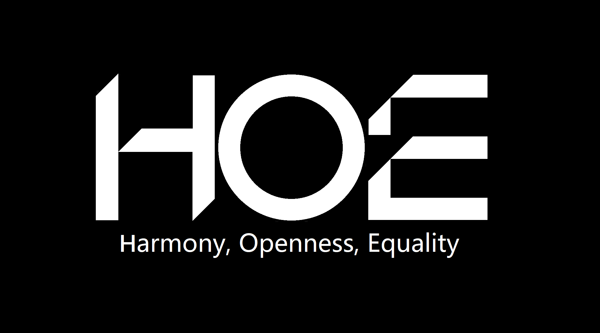

<div align="center" class="logo-container">
   
   
</div>

<div align="center" class="NPL text">
   <p>此项目属于 HOE Team PLAN NO 计划 <a href="#hoe-team-plan-no-计划">了解更多[↗]</a></p>
</div>


<h1 align="center">NNETB's Not Everything Toolbox</h1>
<h1 align="center">非万！</h1>

<div align="center">
    
</div>

<h4 align="center">一款简约高效、技术激进的实验性工具箱</h4>

<div align="center">

[](https://github.com/HOE-Team/Everything-Fine-Toolbox)
[](https://github.com/HOE-Team/Everything-Fine-Toolbox/blob/main/LICENSE)
[](https://github.com/HOE-Team/Everything-Fine-Toolbox/releases)

</div>

---

## 📋 项目状态

> [!IMPORTANT]
> 这是一个**实验性项目**，采用激进的技术栈（KMP + CMP），构建不稳定且不会受到长期维护。我们强烈建议贡献者再三考虑是否参与，因为不保证项目的长期维护和稳定性。

## 📑 目录

- [📋 项目状态](#-项目状态)
- [✨ 特性](#-特性)
- [🖥️ 系统要求](#️-系统要求)
- [🚀 安装](#-安装)
- [⏫ 便携版](#-便携版)
- [🔨 从源代码构建](#-从源代码构建)
- [🤝 如何贡献](#-如何贡献)
- [📁 项目结构](#-项目结构)
- [🔗 技术栈](#-技术栈)
- [📜 版权与许可证](#-版权与许可证)

## ✨ 特性

* **现代UI**：采用 Material Design 3 设计风格
* **技术激进**：使用 Kotlin + Compose Multiplatform 跨平台框架
* **代码透明**：完全开源，可供任何人审计

## 🖥️ 系统要求

* **操作系统**：Windows 10 1909 或更高版本
> [!WARNING]
> 本程序可能无法在 Windows 10 1909 以下版本正常运行，旧系统用户请酌情使用。

* **网络**：需要稳定网络连接
* **特殊网络**：必要时需要使用 VPN（请注意使用的合规性并自行承担后果，本工具不提供 VPN 连接服务）

## 🚀 安装

1. 从本项目的 [Releases](https://github.com/HOE-Team/NNETB/releases) 页面下载最新的 MSI 安装程序
2. 运行 MSI 安装程序
3. 按照安装向导指引完成安装
4. 开始使用

## ⏫ 便携版

> [!IMPORTANT]
> 本项目暂未分发Portable版本，后续请以官方通知为准。

如果你希望将工具箱随身携带：

1. 从 [Releases](https://github.com/HOE-Team/NNETB/releases) 页面下载文件名带有 `-portable` 的版本
2. 使用解压软件解压到你的 USB 设备或其他便携存储介质
3. 随时随地运行使用

## 🔨 从源代码构建

<details>
<summary>Gradle 构建指南（点击展开）</summary>

### 编译环境要求

- Windows 10 1909 或更高版本
- JDK 17 或更高版本
- Git
- Inno Setup 6（用于生成安装程序）

### 构建步骤

1. **克隆仓库**
   ```bash
   git clone https://github.com/HOE-Team/NNETB.git
   cd NNETB
   ```

2. **编译项目**
   ```bash
   .\gradlew.bat compileKotlin --no-daemon --console=plain
   ```

3. **运行应用**
   ```bash
   .\gradlew.bat run
   ```

4. **打包为安装程序**
   ```bash
   .\gradlew.bat packageApplication -PinnoPath="D:\Program Files (x86)\Inno Setup 6\ISCC.exe"
   ```
   
   生成的安装程序文件位于：
   ```
   build/compose/binaries/main/installer/
   ```
   文件名为：`NNETBsNotEverythingToolbox-1.1.0-Setup.exe`

### 高级构建选项

#### 指定工具路径
如果构建工具不在系统PATH中，可以通过参数指定路径：

```bash
# 指定Inno Setup编译器路径
.\gradlew.bat packageApplication -PinnoPath="D:\Program Files (x86)\Inno Setup 6\ISCC.exe"

# 指定rcedit路径（用于图标替换）
.\gradlew.bat packageApplication -PrceditPath="C:\path\to\rcedit.exe"
```

#### 跳过特定任务
```bash
# 跳过图标替换任务（当rcedit未安装时）
.\gradlew.bat packageApplication -x applyIconToExe

# 仅生成可执行文件，不生成安装程序
.\gradlew.bat packageDistributionForCurrentOS
```

### 常见问题

#### 构建失败：乱码错误信息
**问题**：构建时出现类似"锟斤拷息: 锟斤拷锟结供锟斤拷模式锟睫凤拷锟揭碉拷锟侥硷拷锟斤拷"的错误
**原因**：构建工具（Inno Setup或rcedit）未正确安装或不在PATH中
**解决方案**：
1. 安装Inno Setup 6并确保`ISCC.exe`在PATH中，或使用`-PinnoPath`参数指定路径
2. 安装rcedit（可选，用于图标替换）或使用`-x applyIconToExe`跳过该任务

#### 构建失败：工具未找到
**问题**：`applyIconToExe`或`buildInstallerInnoSetup`任务失败
**原因**：rcedit或Inno Setup编译器未安装
**解决方案**：
1. 安装Inno Setup 6（必需）：https://jrsoftware.org/isdl.php
2. 安装rcedit（可选）：https://github.com/electron/rcedit/releases
3. 或使用参数跳过相关任务

#### 构建成功但无图标
**问题**：生成的可执行文件没有自定义图标
**原因**：rcedit未安装或任务被跳过
**解决方案**：
1. 安装rcedit并添加到PATH
2. 或接受默认图标（Compose Desktop生成的图标）

#### 构建时间过长
**原因**：首次构建需要下载依赖包，Inno Setup编译需要时间
**建议**：耐心等待，后续构建会更快

</details>

## 🤝 如何贡献

你可以向我们发送 Issue 或提交 PR。

**但我们不建议你这么做。**

本项目技术栈激进（KMP + CMP），构建不稳定，且不保证长期维护。如果你提交 PR，可能不会被合并，也可能合进去了但项目明天就归档。

> [!NOTE]
> 那为什么还要写 PR 指南？因为——万一真有开发者觉得这个项目值得认真做下去，甚至想把它变成一个正经工具箱，我们不能让人家摸黑进门。门开着，PR 指南写好了，但你进来之前，**请三思**。

如果你三思过后还是想提交，我们感谢你的认真。PR 审核可能会很慢，也可能没有下文，但这不是你的问题，是这个项目状态的问题。

<details>
<summary>PR 提交流程（点击展开）</summary>

### 步骤

1. **创建分支**
   ```bash
   git checkout -b feat/功能描述
   ```

2. **提交代码**
   ```bash
   git add .
   git commit -m "feat: 功能描述"
   ```

3. **推送分支**
   ```bash
   git push origin feat/功能描述
   ```

4. **创建 PR**
   - 前往 GitHub 仓库
   - 点击 "New Pull Request"
   - 选择你的分支
   - 填写标题和描述
   - 提交

### 提交信息格式
```
类型: 描述

feat    - 新功能
fix     - 修复bug
docs    - 文档更新
style   - 代码格式
refactor- 代码重构
```

### 示例
```
git commit -m "feat: 添加新功能"
git commit -m "fix: 修复已知问题"
```

</details>

## 📁 项目结构

```
project/
├─ src/                  # Kotlin 源代码
├─ gradle/               # Gradle 配置
├─ LICENSE               # 许可证
├─ installer.iss         # Inno Setup Script
├─ build.gradle.kts      # 项目构建配置
├─ settings.gradle.kts   # Gradle 设置
├─ gradlew               # Gradle Wrapper (Linux/macOS)
├─ gradlew.bat           # Gradle Wrapper (Windows)
├─ LICENSE               # 许可证
└─ README.md             # 项目说明
```

## 🔗 技术栈

| 组件 | 用途 | 开源协议 |
|------|------|------|
| [Kotlin](https://kotlinlang.org/) | 主要编程语言 | Apache 2.0 |
| [Compose Multiplatform](https://kotlinlang.org/compose-multiplatform/) | 跨平台声明式 UI 框架 | Apache 2.0 |
| [OSHI](https://github.com/oshi/oshi) | 操作系统和硬件信息获取 | MIT |


## 📬 联系方式

你可以通过我们的电子邮箱 hoe_software_team@outlook.com 发送邮件联系我们，我们稍后也会开启GitHub Discussion供大家讨论。

如果你觉得本实验对你的项目开发有启发，欢迎给个 Star 支持！

## 📜 版权与许可证

版权所有 © 2026 HOE Team。保留所有权利。

本项目基于 [MIT 许可证](LICENSE) 开源。

> [!NOTE]
> 这份许可证意味着：
>
> 1. **你可以随意使用这个项目代码**，无论是在个人项目还是商业项目中。
> 2. **你可以修改并重新发布**这个代码。
> 3. **你甚至可以用它来开发商业软件并销售**，只要你在你的产品中包含原始的 MIT 许可证文本和版权声明。
> 4. **作者不提供任何保证**，如果使用该软件导致任何问题，你需要自己承担风险。

> [!WARNING]
> ### 著作权声明
> NNETB 的徽标为 HOE Team 所有，受法律保护。未经明确书面授权，不得用于商业用途或进行修改后使用。

---

# HOE Team PLAN NO 计划
<div align="center" class="plan-no-intro">
    
</div>

PLAN NO 是 HOE Team 发起的技术计划，核心目标是复刻、优化并超越某些挂羊头卖狗肉、开源违规或闭源侵权的劣迹项目。我们不针对“写得差”的开源——差归差，自己写自己担。我们针对的是三类行为：挂 GPL 却喊“我有权不开源”的虚假承诺；用 GPL 代码却闭源分发的规则无视；打包侵权工具、不标许可证、用户崩溃无人管的闭源糟粕。PLAN NO 坚持用现代技术栈、遵守开源规则、提供透明合规的替代方案，用代码说话，做本该更好的工具。

> [!NOTE]
> PLAN NO 徽标采用 CC BY-NC-ND 4.0 许可证发布，允许署名引用，禁止商业用途与修改。